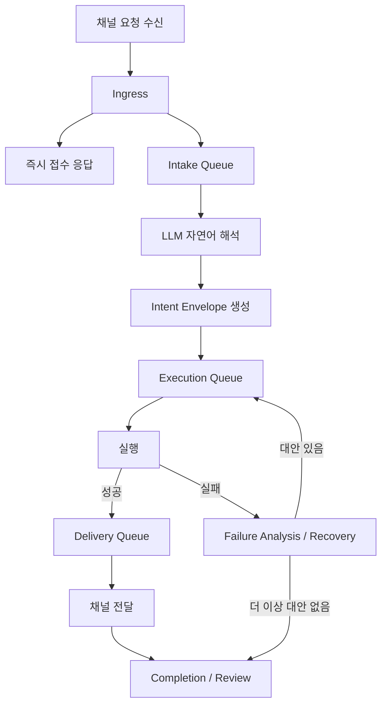
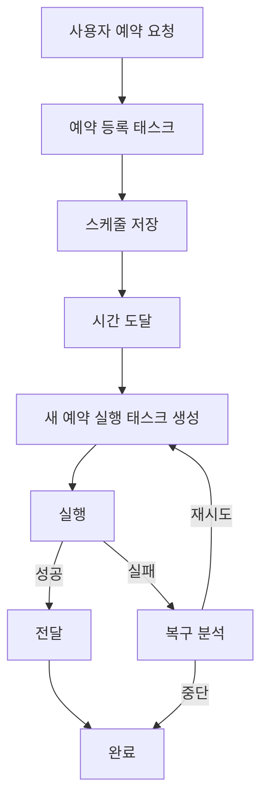
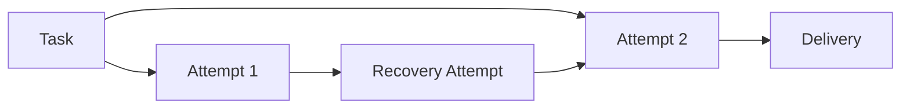

# process-to.md

## 목적

- [result.md](/Users/dongwooshin/WorkPlaces/AtomSoft/Sponzey Family/Sponzey Nobie Platform/Sponzey Nobie/result.md)를 기준으로 현재 프레임워크가 어떤 방향으로 바뀌어야 하는지 정리한다.
- 특히 다음을 명확히 적는다.
  - 현재 구조에서 무엇이 어떻게 바뀌는가
  - 프로세스 구조는 어떻게 재구성되는가
  - 워커 큐, 비동기 처리, 예약 실행은 어떻게 달라지는가
  - 실패 시 어떤 프로세스를 타야 하는가
  - 사용하는 라이브러리 관점에서 변경점이 있는가

## 전제

- 자연어 해석은 계속 `LLM`이 주도한다.
- 시스템을 명령어 기반 리모트 컨트롤러처럼 바꾸지 않는다.
- 개선의 핵심은 `자연어 처리 품질 유지`와 `응답성`, `안정성`, `상태 가시성`을 동시에 높이는 것이다.

---

## 1. 현재 구조와 목표 구조의 차이

## 1-1. 현재 구조

현재는 큰 흐름이 아래처럼 묶여 있다.

1. 채널에서 요청 수신
2. `startRootRun()` 진입
3. intake 분석
4. 실행 분기
5. 도구 실행 / 예약 등록 / 전달
6. 완료 판정

이 구조의 특징:

- 접수 응답과 분석이 사실상 붙어 있다.
- intake, 실행, 실패 처리, 전달, 완료 판정이 하나의 거대한 루프 안에 섞여 있다.
- 예약 등록과 예약 실제 실행이 개념적으로 충분히 분리되어 있지 않다.
- `request_group`이 사용자 의도 단위인지, 실행 흐름 단위인지, 예약 후속 실행 단위인지가 섞일 수 있다.

## 1-2. 목표 구조

목표 구조는 아래처럼 계층을 분리하는 것이다.

1. `Ingress`
2. `Intake`
3. `Execution`
4. `Failure Analysis / Recovery`
5. `Delivery`
6. `Completion / Review`

이 구조의 핵심 차이:

- 접수는 즉시 처리
- 해석은 별도 큐에서 비동기 진행
- 실행은 구조화된 결과만 보고 처리
- 실패는 별도 분석/복구 단계에서 다시 평가
- 전달은 별도 계층에서 채널별로 처리
- 완료 판정은 실행 성공과 전달 성공을 분리해서 본다

즉, 현재는 `하나의 큰 루프`, 목표는 `역할별 파이프라인`이다.

---

## 2. 프로세스 구조는 어떻게 바뀌는가

## 2-1. 현재 프로세스

현재 사용자가 요청을 보내면 체감상 다음과 같이 보인다.

1. 메시지 수신
2. intake 분석 대기
3. 접수/확인 응답 생성
4. 실행
5. 결과 전달

문제:

- 접수 체감이 느리다
- 중간 단계가 많아도 사용자에게 바로 안 보일 수 있다
- 실패 시 어느 단계에서 막혔는지 명확하지 않다

## 2-2. 목표 프로세스

목표는 다음 순서다.

1. 메시지 수신
2. 세션/채널 확인
3. 즉시 접수 응답
4. Intake Queue 등록
5. LLM 기반 자연어 해석
6. 구조화된 `intent envelope` 생성
7. Execution Queue 등록
8. 실제 실행
9. 실패 시 원인 분석
10. 기존 방식 평가 및 대안 생성
11. 필요 시 재실행
12. Delivery Queue 등록
13. 채널 전달
14. Completion / Review

여기서 중요한 변화:

- 사용자는 3단계에서 즉시 응답을 받는다
- 5단계의 자연어 해석은 여전히 LLM이 맡는다
- 8단계 이후는 자연어가 아니라 구조화 결과를 기반으로 움직인다
- 실패 시에도 바로 종료하지 않고, 원인 분석과 대안 생성 단계를 별도로 탄다

---

## 3. 계층별로 무엇이 어떻게 바뀌는가

## 3-1. Ingress

### 현재

- 채널 계층이 요청을 받아 `startRootRun()`으로 바로 연결한다.
- 일부 채널은 실행 완료까지 같은 흐름을 오래 잡고 있게 된다.

### 목표

- Ingress는 무거운 해석을 하지 않는다.
- 해야 하는 일은 다음으로 제한한다.
  - 세션 확인
  - 채널/대상 식별
  - 요청 ID 발급
  - 즉시 접수 응답
  - Intake Queue에 전달
  - request-group 재사용 / 활성 실행 취소 같은 entry semantics 계산

### 기대 효과

- 사용자 체감 지연 감소
- 채널 핸들러와 태스크 실행 엔진의 결합도 감소

## 3-2. Intake

### 현재

- 자연어 해석, 일정 인식, 일부 휴리스틱, 재연결 판단, 후속 action 생성이 한 덩어리다.
- 자연어 요청은 intake 완료 전까지 다음 단계로 못 간다.

### 목표

- Intake는 오직 `자연어 해석과 구조화`만 담당한다.
- 결과물은 아래와 같은 envelope가 된다.

예시:
- `intent_type`
- `target`
- `destination`
- `complete_condition`
- `execution_semantics`
- `schedule_spec`
- `delivery_mode`
- `requires_approval`

- envelope 생성 전에는 필수 필드 검증과 fallback 보정을 수행한다.
- downstream은 검증이 끝난 envelope만 사용한다.

### 기대 효과

- 실행 단계에서 문자열 비교 감소
- 자연어는 계속 LLM이 해석하되, 실행 로직은 더 단순해짐

## 3-3. Execution

### 현재

- 실행과 완료 판정, 일부 복구가 강하게 결합되어 있다.
- 예약 등록과 실제 실행도 이 흐름 안에서 엮이기 쉽다.

### 목표

- Execution은 Intake가 만든 구조화 결과만 본다.
- 자연어 원문을 다시 이해하려 하지 않는다.
- 책임:
  - Yeonjang 호출
  - 로컬 도구 실행
  - 파일 생성/수정
  - 예약 등록
  - 권한 요청 트리거
- Execution 결과는 문자열 요약만이 아니라 구조화된 receipt를 남겨야 한다.
  - tool 실행: 성공/실패, 파일 변경 여부, 변경 경로, command failure 여부
  - 예약 등록: 일회성 예약 / 반복 예약 / 취소를 구분하는 schedule receipt
  - worker runtime 경로: 어떤 실행 엔진을 탔는지 알 수 있는 execution stream 경계

### 기대 효과

- 실행 계층의 책임 명확화
- 도구 실패와 해석 실패를 분리 가능
- 이후 Completion, Delivery, Recovery가 실행 결과를 문자열 재해석 없이 사용할 수 있음

## 3-4. Failure Analysis / Recovery

### 현재

- 실패 처리, 재시도, 복구, 사용자 확인이 실행 루프와 강하게 섞여 있다.
- 어떤 실패는 즉시 종료되고, 어떤 실패는 재질의 예산을 쓰며 재분석되며, 어떤 실패는 전달 실패와 뒤섞인다.
- 그래서 실패의 의미와 다음 액션이 불명확해질 수 있다.

### 목표

- 실패는 별도 단계에서 다룬다.
- 이 단계의 책임은 다음과 같다.
  - 실패 유형 분류
  - 실패 지점 식별
  - 기존 시도 방식 평가
  - 왜 실패했는지 분석
  - 다른 실행 방안 생성
  - 재시도 여부 결정

### 실패 분석 단계에서 봐야 할 항목

- 해석 실패인가
- 실행 실패인가
- 전달 실패인가
- 권한 부족인가
- 외부 시스템/채널 실패인가
- 현재 방식을 다시 시도해도 의미가 있는가
- 다른 도구, 다른 연장, 다른 경로가 있는가

### 복구 결과는 구조화된 대안 후보를 가져야 한다

실패 분석 결과는 단순한 설명문으로 끝내지 않고, 최소한 아래와 같은 대안 종류를 구조화해 가져가는 것이 좋다.

- `other_tool`
- `other_extension`
- `other_channel`
- `other_schedule`
- `same_channel_retry`

이 구조가 있으면 실행 루프는 복구 문장을 다시 해석하지 않고도

- 다른 도구 조합을 시도할지
- 다른 연장 또는 다른 실행 대상을 고를지
- 같은 채널 재전송을 할지
- 다른 전달 채널을 검토할지
- 다른 예약 방식으로 바꿀지

를 분기할 수 있다.

### 기대 효과

- 실패가 단순 종료로 이어지지 않음
- “왜 실패했는지”와 “이제 뭘 할지”가 분리되어 관리됨
- 복구 루프를 실행 루프와 분리해 상태 가시성이 높아짐
- 재시도 예산도 `interpretation / execution / delivery / external`처럼 failure kind별로 따로 관리할 수 있음

## 3-5. Delivery

### 현재

- 일부는 실행과 동시에 채널 응답을 직접 밀어넣는다.
- 텍스트 전달, 파일 전달, 메신저 전달, direct delivery가 실행 루프와 섞여 있다.

### 목표

- Delivery는 실행 결과를 채널/형식별로 전달만 담당한다.
- 책임:
  - Telegram 텍스트 전송
  - Telegram 파일 전송
  - WebUI 응답 반영
  - CLI 출력
  - 예약 알림 발화

### 전달 계층은 순서 보장도 가져야 한다

- 결과물 파일과 설명 텍스트를 함께 보내는 경우, 채널별 helper가 전달 순서를 보장해야 한다.
- 예를 들어 Telegram에서는 artifact 전달이 먼저, 최종 텍스트 응답은 그 다음에 나가도록 경계를 고정하는 것이 맞다.
- 이렇게 해야 Completion이 `실행 성공`과 `전달 순서 완료`를 함께 판단할 수 있다.

### 기대 효과

- 실행 성공과 전달 성공을 구분 가능
- `실행은 됐는데 전달이 안 됨`을 명확히 식별 가능

## 3-6. Completion / Review

### 현재

- 완료 판정이 실행 성공, 전달 성공, 사용자 응답 텍스트와 섞일 수 있다.

### 목표

- Completion은 다음을 따로 본다.
  - 해석 성공 여부
  - 실행 성공 여부
  - 전달 성공 여부
  - 추가 확인 필요 여부

### 기대 효과

- 잘못된 완료 판정 감소
- “실패했는데 완료”, “전달했는데 미완료” 같은 문제 축소

---

## 4. 워커 큐는 어떻게 바뀌는가

## 4-1. 현재 큐 구조

현재는 주로 다음 큐가 핵심이다.

- `requestGroupExecutionQueues`
- `delayedSessionQueues`

이들은 이미 순차 실행을 보장하지만, 의미적으로는 다음이 섞여 있다.

- 사용자 의도 단위
- 후속 실행 단위
- 예약 실행 단위
- 같은 세션의 지연 작업 단위

즉, 직렬화는 하고 있지만 “왜 직렬화하는지”가 충분히 분리되어 있지 않다.

## 4-2. 목표 큐 구조

권장 큐는 목적별로 나눈다.

### Intake Queue

- 목적: LLM 해석 부하 제어
- 단위: `task intake job`
- 병렬 정책:
  - 세션 기준 1개
  - 전체 시스템 기준 제한 가능

### Execution Queue

- 목적: 도구 실행 충돌 방지
- 단위: `execution attempt`
- 병렬 정책:
  - Yeonjang 대상 자원별 직렬화 가능
  - 파일 수정 충돌 방지 가능

### Recovery Queue

- 목적: 실패한 실행의 원인 분석과 대안 생성
- 단위: `recovery job`
- 병렬 정책:
  - 같은 task에 대해서는 순차 평가
  - 해석 실패, 실행 실패, 전달 실패를 분리 관리

### Delivery Queue

- 목적: 채널 메시지 순서 보장
- 단위: `delivery job`
- 병렬 정책:
  - 채널/세션별 순서 보장

### Schedule Queue

- 목적: 예약 실행 lifecycle 분리
- 단위: `scheduled task firing`
- 병렬 정책:
  - 원 요청 태스크와 분리
  - 동일 schedule id에 대한 중복 firing 방지

## 4-3. 워커 큐 도입 시 기대 효과

- 접수 응답과 실제 분석을 분리 가능
- 예약 실행이 원 태스크와 섞이지 않음
- 재시도 정책을 단계별로 분리 가능
- 상태 모니터에서 단계별 가시성이 높아짐
- 실패 분석과 재시도 경로를 별도 큐로 제어 가능

---

## 5. 비동기 처리 구조는 어떻게 바뀌는가

## 5-1. 현재 비동기 구조

- 단일 Node 이벤트 루프 기반
- 외부 실행은 `child_process`
- 내부 오케스트레이션은 Promise/async 기반
- 일부 큐는 `Map<string, Promise<...>>` 형태의 직렬화

이 구조는 가볍고 데스크탑/로컬 앱 환경에 잘 맞는다.

## 5-2. 목표 비동기 구조

기본 철학은 바꾸지 않는 것이 좋다.

즉:
- 무거운 멀티스레드 프레임워크로 바로 가지 않음
- Node 이벤트 루프 + async/await + 목적별 큐를 유지
- 필요한 경우만 외부 프로세스 사용

달라지는 점:
- “실행 함수 하나가 다 하는 구조”에서
- “이벤트/큐 기반 단계 전달 구조”로 이동

예시 이벤트:
- `task.received`
- `task.accepted`
- `intake.started`
- `intake.completed`
- `execution.started`
- `execution.failed`
- `recovery.started`
- `recovery.alternative_selected`
- `recovery.retry_scheduled`
- `delivery.started`
- `delivery.completed`
- `task.completed`

## 5-3. 추천 방향

- 이벤트 기반 비동기 구조를 더 명시적으로 만든다
- 각 단계는 다음 단계에 메시지/레코드/큐 작업을 넘긴다
- 한 함수가 전 과정을 오래 붙잡지 않게 한다

---

## 6. 예약 구조는 어떻게 바뀌는가

## 6-1. 현재 문제

- 예약 등록과 예약 실행이 같은 계보 안에 있지만
- 같은 `request_group`까지 재사용하는 경향이 있다
- 그래서 완료된 태스크가 다시 실행되는 것처럼 보일 수 있다

## 6-2. 목표 구조

예약은 2단계로 분리한다.

### 예약 등록 태스크

- 사용자의 요청을 해석
- 스케줄 등록
- 등록 성공/실패만 책임짐

### 예약 실행 태스크

- 스케줄 시간이 도달했을 때 별도 생성
- 독립 task instance
- 독립 run
- 독립 completion

단, 연결 정보는 유지한다.

예:
- `parent_task_id`
- `schedule_id`
- `origin_session_id`
- `origin_channel`

## 6-3. 기대 효과

- 중복 실행처럼 보이는 현상 감소
- 예약 실행 실패가 원 요청 태스크를 오염시키지 않음
- 상태 모니터에서 등록과 실행을 분리해서 보여줄 수 있음

---

## 7. 태스크/시도/전달 모델은 어떻게 바뀌는가

## 7-1. 현재

- 사용자에게는 하나의 태스크처럼 보이지만
- 내부적으로는 여러 run이 섞여 보일 수 있다

## 7-2. 목표

아래 네 층을 분리한다.

### Task

- 사용자의 의도
- 예: `30초 뒤 안녕이라고 말해줘`

### Attempt

- 그 태스크를 해결하려는 실제 실행 시도
- intake 시도, schedule 등록 시도, 실행 시도 등

### Recovery Attempt

- 실패한 시도를 다시 평가하고 대안 경로를 만들기 위한 별도 복구 시도
- 예:
  - 원래 Yeonjang 경로 실패 후 로컬 fallback 검토
  - 전달 실패 후 다른 채널/방식 검토
  - 일정 등록 실패 후 분 단위 fallback 검토

### Delivery

- 최종 전달 작업
- telegram text, telegram file, webui response 등

## 7-3. 기대 효과

- “왜 두 번 돌았는지”를 설명 가능
- “왜 완료인데 또 움직였는지”를 추적 가능
- 상태 모니터 UI도 더 정직해짐
- “실패했지만 복구 루프를 타는 중”인지도 명확히 구분 가능

---

## 8. 라이브러리 관점의 변경점

## 8-1. 유지해도 되는 라이브러리

현재 핵심 라이브러리 중 다수는 그대로 유지 가능하다.

### 그대로 유지 권장

- `fastify`
  - API 서버/웹소켓 계층에 적합
- `grammy`
  - Telegram 채널 유지에 적합
- `better-sqlite3`
  - 로컬 상태 저장, task/attempt/delivery 기록, schedule 메타 저장에 적합
- `mqtt`, `aedes`
  - Yeonjang 및 MQTT 브로커 구조 유지 가능
- `openai`, `@anthropic-ai/sdk`
  - LLM provider 계층 유지 가능

즉, 이번 구조 개편은 반드시 대규모 라이브러리 교체를 요구하지 않는다.

## 8-2. 선택적으로 추가를 검토할 수 있는 라이브러리

필수는 아니지만 고려 가능한 것들:

### Queue 라이브러리

- 예: `p-queue`, `p-limit`
- 장점:
  - 간단한 병렬도 제어
  - 목적별 큐 추상화가 쉬움
- 단점:
  - 현재 Promise 기반 큐와 기능 차이가 아주 크진 않음

의견:
- 초기 단계에서는 새 라이브러리 없이도 구현 가능
- 큐 계층을 명확히 추상화한 뒤 필요하면 도입하는 편이 좋다

### Schema Validation 라이브러리

- 예: `zod`, `valibot`
- 용도:
  - `intent envelope`
  - `delivery receipt`
  - `schedule spec`
  - `recovery plan`
  검증

의견:
- 도입 가치가 높다
- LLM 결과와 내부 이벤트 payload를 검증하기 좋다

### Job Queue / Broker 계열

- 예: `bullmq`, Redis 기반 큐
- 장점:
  - durable queue
  - 재시도/예약/worker 관리가 강력
- 단점:
  - 로컬 앱/데스크탑 환경에 과함
  - Redis 의존성 증가

의견:
- 현재 제품 성격에는 과한 편
- 지금 단계에서는 비추천

## 8-3. 라이브러리 변경에 대한 결론

- 대규모 라이브러리 교체는 필요 없다
- 우선은 현재 스택 유지
- 필요한 경우에만
  - 큐 추상화용 경량 라이브러리
  - 스키마 검증 라이브러리
  정도를 선택적으로 추가하는 것이 좋다

---

## 9. 프로세스 다이어그램

---

## 10. 단계별 도입 순서

## 10-1. 1단계

- 접수 응답 즉시 분리
- Ingress와 Intake 경계 분리

## 10-2. 2단계

- 예약 등록과 예약 실행 분리
- 예약 실행은 새 태스크로 시작

## 10-3. 3단계

- Delivery Queue 분리
- 채널 전달을 실행과 분리

## 10-4. 4단계

- Execution Queue 분리
- Yeonjang/로컬 도구 충돌 제어

## 10-5. 5단계

- Failure Analysis / Recovery 단계 분리
- 실패 유형별 복구 정책과 예산 분리

## 10-6. 6단계

- Intent Envelope를 전역 표준으로 고정
- 이후 실행, 전달, 완료 판정은 이 구조를 기준으로 움직이게 함

---

## 최종 정리

- 이번 개편의 핵심은 `LLM을 빼는 것`이 아니다.
- 핵심은 `LLM이 해석한 자연어 결과를 안정적으로 흘려보내는 파이프라인`을 만드는 것이다.
- 따라서 필요한 것은 무거운 멀티스레드 전환보다
  - 계층 분리
  - 큐의 목적 분리
  - 실패 분석과 대안 생성 분리
  - 예약 실행의 독립성
  - 실행/전달/완료 분리
  - 구조화 결과의 검증
  쪽이다.
- 현재 스택은 대부분 유지 가능하며, 필요한 경우 경량 큐/스키마 검증 라이브러리 정도만 보강하면 된다.
