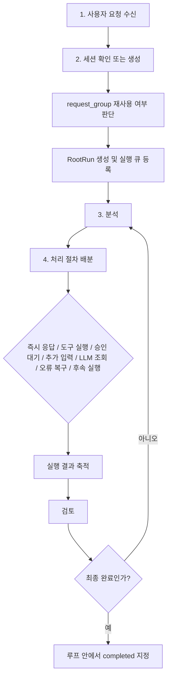
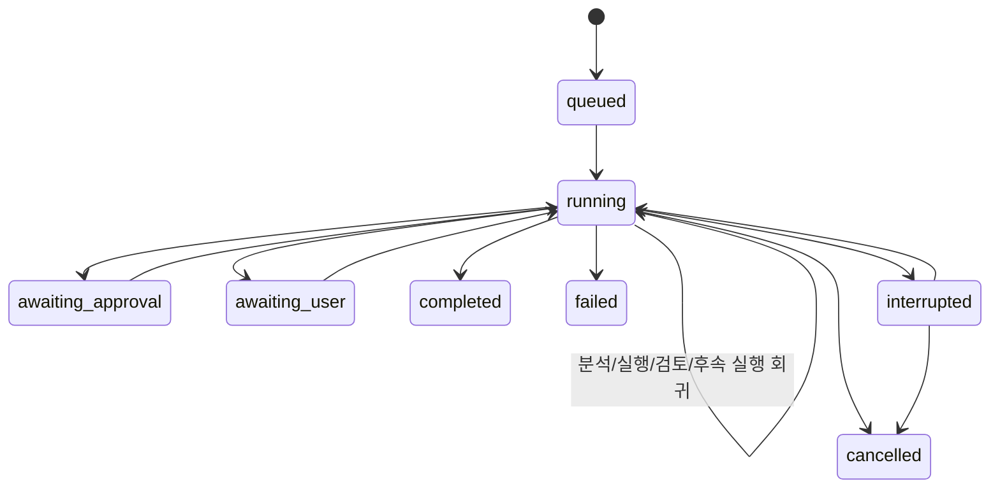
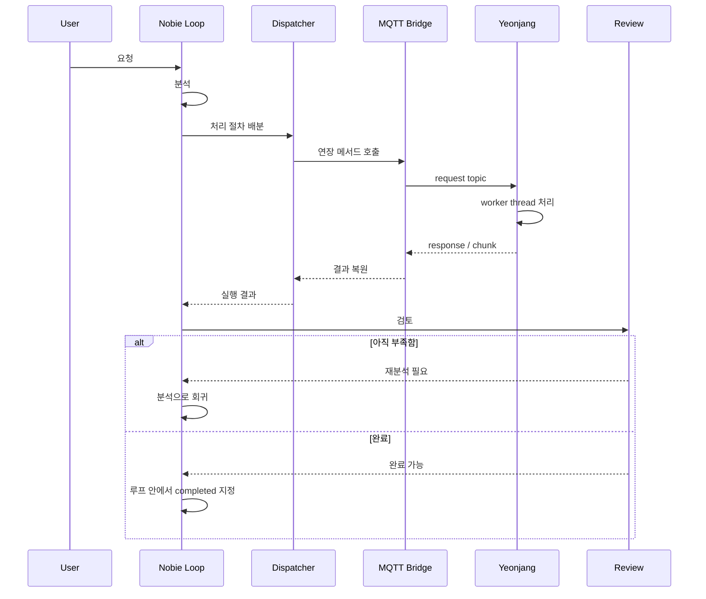

# Nobie 태스크 프로세스

이 문서는 현재 Nobie의 태스크 처리 절차를 `루프 중심`으로 정리한 문서다.

여기서 태스크의 실제 실행 단위는 `RootRun`이며, 하나의 사용자 요청은 보통 하나의 `request_group` 안에서 여러 번 분석되고, 여러 번 후속 실행되며, 최종 완료 여부도 같은 메인 루프 안에서만 결정된다.

## 1. 최상위 원칙

현재 태스크 프로세스는 아래 원칙으로 이해해야 한다.

1. 사용자 요청은 한 번 해석하고 끝내는 구조가 아니다.
2. 요청은 `분석 -> 처리 분배 -> 검토 -> 재분석`의 루프를 돈다.
3. 절대 루프 밖에서 최종 완료를 선언하지 않는다.
4. 최종 완료는 메인 루프 안에서만 지정한다.
5. 승인 대기, 추가 입력 대기, 도구 실행, LLM 조회, 오류 복구, 후속 실행 생성도 모두 루프 안에서 배분한다.
6. `store.ts`는 상태를 저장하고 방송할 뿐이며, 완료의 의미를 판정하는 핵심 위치는 `start.ts` 메인 루프다.

## 2. 태스크의 실제 단위

### 2.1 RootRun

`RootRun`은 Nobie가 실제로 추적하는 태스크 실행 단위다.

포함 내용:

- 사용자 요청
- 실행 상태
- 단계
- 요약
- 최근 이벤트
- 취소 가능 여부
- 재질의 카운트

### 2.2 request_group

`request_group`은 하나의 원 요청과 그에 이어지는 후속 요청, reply, 수정 지시, 재질의를 묶는 상위 단위다.

의미:

- 같은 태스크의 후속 요청은 같은 그룹으로 이어질 수 있다
- 같은 그룹 안의 실행은 직렬화된다
- Telegram 답장(reply)도 같은 태스크 그룹으로 재진입할 수 있다

### 2.3 session

`session`은 채널 단위 대화 세션이다.

- WebUI
- CLI
- Telegram

세션은 “어느 대화 흐름에서 들어온 요청인가”를 구분하고, `request_group`은 “그 대화 안에서 어떤 태스크 흐름에 속하는가”를 구분한다.

## 3. 기본 절차

사용자 요청은 기본적으로 아래 절차를 따른다.

1. 사용자 요청 수신
2. 세션 확인 또는 새 세션 생성
3. 분석
4. 처리 절차 배분
5. 다시 분석으로 회귀

이 구조를 더 실제 코드에 맞게 풀면 다음과 같다.

1. 사용자 요청 수신
2. 세션 확인 또는 생성
3. 기존 `request_group` 재사용 여부 판단
4. `RootRun` 생성
5. 같은 `request_group` 실행 큐에 등록
6. 분석
7. 처리 절차 배분
8. 결과 검토
9. 다시 분석 또는 완료

이때 `request_group` 재사용은 종료되지 않은 그룹에만 적용한다.

- 재사용 가능: `queued`, `running`, `awaiting_approval`, `awaiting_user`
- 재사용 금지: `completed`, `failed`, `cancelled`, `interrupted`

즉 완료, 실패, 취소된 기존 태스크에 답장하거나 같은 그룹으로 재연결을 시도해도 새 태스크로 시작한다.
또한 참조형 수정 문구처럼 보여도 재사용 가능한 활성 후보가 하나도 없으면, 추가 clarification으로 보내지 않고 새 태스크로 시작한다.

## 4. 메인 루프 중심 구조

아래가 현재 태스크 처리의 핵심 구조다.

이 다이어그램에서 중요한 점은 아래와 같다.

- `분석`은 한 번만 하지 않는다
- `처리 절차 배분`도 한 번만 하지 않는다
- 실행 결과를 본 뒤 다시 분석으로 되돌아갈 수 있다
- 최종 완료는 반드시 `검토 -> 완료 판정` 구간에서만 이뤄진다

## 5. 루프 안에서 배분되는 것들

메인 루프 안에서는 아래 케이스를 모두 처리한다.

### 5.1 즉시 응답

요청이 단순 응답, 취소 처리, 일정 처리 같은 경우라면 루프 안에서 즉시 응답으로 끝낼 수 있다.

### 5.2 도구 실행

분석 결과 실제 실행이 필요하면 루프 안에서 도구를 고른다.

우선순위:

1. 적절한 Yeonjang 도구
2. 적절한 본체 도구
3. 그래도 없으면 다른 실행 경로

### 5.3 승인 대기

권한이 필요한 작업이면 루프 안에서 승인 요청 상태로 보낸다.

- `awaiting_approval`
- `awaiting_user`

승인 요청도 루프 외 별도 종료가 아니라 루프가 만든 대기 상태다.

### 5.4 추가 입력 대기

정보가 부족하거나 사용자의 선택이 필요하면 루프 안에서 `awaiting_user`로 이동한다.

### 5.5 LLM 조회

분석, 라우팅, 후속 실행 생성, 검토는 모두 루프 안에서 LLM을 사용할 수 있다.

### 5.6 오류 복구

아래 오류도 루프 안에서 다시 처리한다.

- LLM 오류
- worker runtime 오류
- 도구 실행 실패
- 파일 검증 실패
- 전달 실패

즉 오류가 났다고 곧바로 루프 바깥에서 끝내는 것이 아니라, 가능한 한 루프 안에서 `복구 -> 재분석 -> 다른 경로 시도`로 이어져야 한다.

### 5.7 후속 실행

현재 결과가 부분 완료에 가깝고, 시스템이 스스로 더 진행할 수 있으면 follow-up을 생성해서 다시 루프 초입으로 보낸다.

## 6. 실제 프로세스 상세

## 6.1 사용자 요청 수신

입력 경로:

- WebUI
- CLI
- Telegram
- Scheduler

Telegram reply는 기존 태스크에 붙을 수 있고, 기존 액션을 취소한 뒤 같은 태스크 안에서 새 액션으로 이어질 수 있다.

## 6.2 세션 확인 또는 생성

요청을 받은 뒤 먼저 현재 채널의 세션을 확인한다.

- 세션이 있으면 재사용
- 없으면 새 세션 생성

## 6.3 request_group 판단

다음 요청이면 기존 그룹을 재사용할 수 있다.

- 이전 결과 수정
- 이어서 진행
- 같은 태스크에 대한 피드백
- Telegram 답장

모호하면 루프 안에서 사용자 확인으로 보낸다.

## 6.4 RootRun 생성

이 단계에서 생성되는 것:

- run row
- 기본 단계 목록
- 초기 이벤트
- 현재 요약

하지만 여기서 “최종 완료”가 결정되지는 않는다. 여기서는 실행 단위를 만들 뿐이다.

## 6.5 실행 큐 등록

같은 `request_group` 안의 태스크는 순차 실행 큐로 들어간다.

이유:

- 같은 태스크의 후속 요청이 서로 섞이지 않게 하기 위해
- reply로 들어온 수정 요청이 기존 실행을 정리한 뒤 이어지게 하기 위해

## 6.6 분석

분석 단계는 요청을 구조화한다.

분석 대상:

- 요청 의도
- 실행 필요 여부
- 일정 관련 여부
- 답변만으로 충분한지
- 사용자 추가 확인이 필요한지
- 어떤 작업 항목으로 분해할지

이 분석 결과가 다음 처리 절차 배분의 입력이 된다.

## 6.7 처리 절차 배분

현재 코드 기준으로 루프는 분석 결과를 보고 다음 중 하나 이상을 배분한다.

- 즉시 응답
- 실행 대상 선택
- worker runtime 실행
- 기본 agent 실행
- 도구 실행
- 승인 요청
- 사용자 추가 확인
- 오류 복구
- follow-up 생성

즉, “모든 케이스는 루프에서 배분한다”는 말은 실제로 여기서 성립한다.

## 6.8 결과 축적

루프는 실행 중 아래 정보를 누적한다.

- 텍스트 응답
- 성공한 도구 실행
- 성공한 파일 전달
- 실패한 명령 실행
- 오류 메시지
- 복구용 힌트

이 축적 결과가 다음 검토 단계로 넘어간다.

## 6.9 검토

검토는 “도구가 성공했는가”만 보지 않는다.

검토 기준:

- 원래 사용자 요청이 실제로 충족됐는가
- 파일을 보여달라는 요청이면 실제 전달까지 끝났는가
- 단순 생성 요청이면 생성과 검증이 끝났는가
- 아직 시스템이 자율적으로 더 해야 할 일이 남았는가
- 정말 사용자 입력이 필요한가

## 6.10 다시 분석으로 회귀

검토 결과가 아래라면 다시 루프로 돌아간다.

- 아직 부족함
- follow-up 필요
- 다른 경로 시도 가능
- 오류 복구 필요

이때 재질의 카운트가 올라가고, 남은 작업만 담은 후속 실행으로 다시 분석에 들어간다.

## 7. 완료는 어디서 선언되는가

핵심 원칙:

- 완료는 루프 밖에서 선언하지 않는다
- 최종 완료는 루프에서만 지정한다

현재 구조에서 의미상 완료를 결정하는 주체는 `start.ts` 메인 루프다.

메인 루프는 다음을 판단한다.

- 완료
- follow-up
- ask_user
- failed
- cancelled

반면 `store.ts`는 다음 역할이다.

- 상태 저장
- 이벤트 발행
- 단계 저장
- 요약 저장
- 외부 취소 반영

즉:

- `start.ts` = 의미 판단
- `store.ts` = 반영

## 8. 상태 전이

이 다이어그램에서 중요한 점은 `running` 안에서 다시 `running`으로 되돌아오는 회귀다.

즉 실행 중 상태는 단순 직선 흐름이 아니라:

- 분석
- 처리 배분
- 실행
- 검토
- 재분석

의 반복 구조를 가진다.

## 9. 승인, 입력 대기, 후속 실행도 루프의 일부

### 9.1 승인

승인은 루프가 만든 중간 상태다.

- 승인 요청 생성
- 대기
- 승인 결과 수신
- 다시 루프 복귀

### 9.2 추가 입력 대기

추가 입력도 루프가 만든 중간 상태다.

- 모호하거나 필수 정보 없음
- 사용자 응답 기다림
- 응답이 들어오면 같은 태스크 안에서 다시 루프 복귀

### 9.3 follow-up

follow-up도 루프의 종료가 아니라 루프의 연장이다.

- 남은 작업이 있으면 follow-up prompt 생성
- 재질의 카운트 증가
- 다시 분석 단계로 복귀

## 10. 연장(Yeonjang) 경로도 루프 안에서 다룬다

연장을 사용하는 작업도 별도 특수 종료 경로가 아니라 루프 안에서 처리된다.

절차:

1. 루프가 연장 사용을 배분
2. MQTT request 발행
3. 연장이 worker thread에서 처리
4. response 또는 chunk 응답 회신
5. Nobie가 응답 재조합
6. 다시 검토 단계로 복귀

## 11. 실패와 취소도 루프 기준으로 이해해야 한다

### 11.1 실패

실패는 다음에 가깝다.

- 가능한 경로를 시도했음
- 복구 재시도도 했음
- 그래도 요청의 최종 목적을 충족하지 못함

즉 단일 도구 실패 한 번으로 곧바로 실패가 되는 것이 아니라, 원칙상 루프 안에서 가능한 대안을 본 뒤 실패해야 한다.

### 11.2 취소

취소는 아래 경우에 발생할 수 있다.

- 사용자 직접 취소
- 같은 태스크 reply가 기존 액션을 갈아탐
- 자동 중단 후 cancelled 처리

취소도 루프 밖 별도 종료라기보다, 루프가 상태를 결정한 결과다.

## 12. 문서 기준 정리

현재 태스크 프로세스를 한 줄로 요약하면 아래와 같다.

1. 사용자 요청을 받는다
2. 세션을 확인하거나 새로 만든다
3. 분석한다
4. 처리 절차를 루프 안에서 배분한다
5. 다시 분석한다
6. 충분할 때만 루프 안에서 완료를 선언한다

즉 Nobie의 태스크 프로세스는 `직선형 파이프라인`보다 `회귀형 루프`로 이해하는 것이 맞다.
