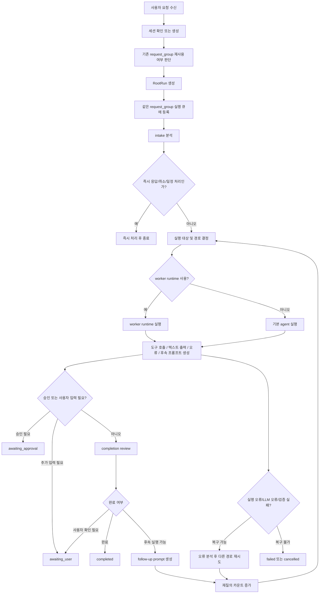
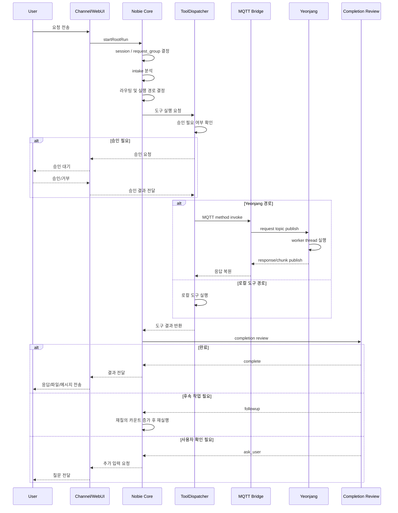
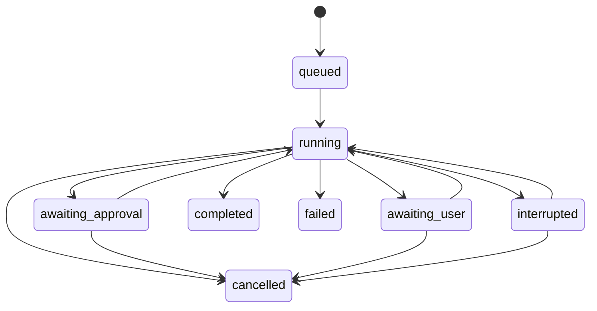

# Nobie 태스크 프로세스

이 문서는 현재 코드 기준에서 `태스크`가 어떻게 생성되고, 실행되고, 대기하거나 종료되는지를 정리한 문서다.

여기서 말하는 태스크의 실제 실행 단위는 `RootRun`이며, 하나의 사용자 요청은 보통 하나 이상의 `RootRun`과 하나의 `request_group`으로 관리된다.

## 1. 핵심 개념

### 1.1 태스크의 실제 단위

- `RootRun`
  - Nobie가 실제로 상태를 추적하는 실행 단위
  - 사용자 요청, 실행 단계, 요약, 최근 이벤트, 취소 가능 여부를 가진다
- `request_group`
  - 하나의 원 요청과 그에 이어지는 수정 요청, 재질의, 후속 실행을 묶는 상위 단위
  - 같은 그룹 안의 실행은 순차 실행 큐로 직렬화된다
- `session`
  - 채널 단위 대화 세션
  - WebUI, Telegram, CLI 모두 세션 개념으로 들어온다
- `worker_session`
  - 외부 worker runtime이나 대상별 세션을 구분하기 위한 하위 세션 식별자

### 1.2 상태

`RootRun`은 현재 아래 상태를 사용한다.

- `queued`
- `running`
- `awaiting_approval`
- `awaiting_user`
- `completed`
- `failed`
- `cancelled`
- `interrupted`

### 1.3 단계

기본 단계는 아래 순서로 관리된다.

1. `received`
2. `classified`
3. `target_selected`
4. `executing`
5. `reviewing`
6. `awaiting_approval`
7. `awaiting_user`
8. `finalizing`
9. `completed`

실제 실행은 이 단계를 그대로 한 번만 통과하는 구조가 아니라, `executing -> reviewing -> followup -> executing`처럼 다시 순환할 수 있다.

## 2. 입력 경로

태스크는 여러 입력 경로에서 시작될 수 있다.

- WebUI
- CLI
- Telegram
- Scheduler

Telegram의 경우에는 `reply-to` 메시지를 통해 기존 태스크의 `request_group`에 다시 붙을 수 있다. 이 경우 새 요청은 완전히 별도 태스크가 아니라 기존 태스크 흐름의 후속 요청으로 이어진다.

## 3. 전체 흐름 요약

현재 구조에서 태스크는 대체로 아래 순서를 따른다.

1. 사용자 요청 수신
2. 세션 결정 또는 생성
3. `request_group` 재사용 여부 판단
4. `RootRun` 생성
5. 같은 `request_group` 실행 큐에 등록
6. intake 분석
7. 실행 대상과 실행 방식 결정
8. 실제 실행
9. 승인 필요 시 대기
10. 결과 검토
11. 부족하면 follow-up 또는 복구 재시도
12. 충분하면 완료 처리

## 4. 메인 플로우

## 5. 더 구체적인 순서

### 5.1 요청 수신과 세션 결정

- 요청이 들어오면 먼저 현재 채널에 맞는 `sessionId`를 찾는다
- 없으면 새 세션을 만든다
- Telegram reply 메시지면 기존 태스크의 `request_group`를 재사용할 수 있다

### 5.2 `request_group` 결정

Nobie는 새 요청을 항상 완전히 새로운 태스크로 보지 않는다.

- 이전 작업 수정
- 이어서 진행
- 방금 결과에 대한 피드백
- 같은 Telegram 답장 흐름

같은 형태로 보이면 기존 `request_group`를 재사용한다.

이 단계에서 모호하면 사용자 확인으로 보낼 수 있다.

### 5.3 `RootRun` 생성

`createRootRun()`이 다음을 초기화한다.

- run 상태
- 기본 단계 목록
- 첫 이벤트 `요청 수신`
- 요청 제목, 요약, 총 단계 수

이 시점에 UI와 이벤트 버스로 `run.created`, `run.progress`가 발행된다.

### 5.4 `request_group` 실행 큐

같은 `request_group` 안의 실행은 병렬로 섞이지 않도록 직렬화된다.

의미:

- 같은 태스크의 후속 수정이 먼저 끝나기 전에 다른 후속 요청이 끼어들지 않음
- reply로 들어온 수정 요청도 같은 태스크 안에서 순서 있게 이어짐

## 6. intake 단계

intake는 요청을 바로 도구 실행으로 보내기 전에 다음을 구조화한다.

- 요청 의도
- 실행이 필요한지
- 일정/스케줄 관련인지
- 즉답 가능한지
- 사용자에게 다시 물어야 하는지
- 후속 작업 항목이 무엇인지

intake 결과는 대체로 아래 방향 중 하나로 이어진다.

- 즉답
- 태스크 실행
- 대리 실행 위임
- 일정 생성/수정/취소
- 사용자 추가 확인

## 7. 실행 대상과 실행 경로 결정

실행 전에는 라우팅이 이루어진다.

주요 판단 요소:

- `taskProfile`
- 요청의 종류
- 현재 사용 가능한 도구
- 연장(Yeonjang) 사용 가능 여부
- worker runtime 사용 가능 여부
- 권한 필요 여부
- 파일 시스템 변경 필요 여부

현재 원칙상:

- 시스템 권한이나 시스템 제어가 필요한 작업은 가능한 경우 `Yeonjang`이 최우선이다
- 파일/권한 작업은 설명만 하는 worker보다 실제 도구 경로를 우선한다

## 8. 실제 실행 루프

메인 실행 루프는 `start.ts` 안에서 돈다.

이 루프는 실행 중 아래 산출물을 계속 모은다.

- 텍스트 응답
- 성공한 도구 실행 목록
- 성공한 파일 전달 목록
- 실패한 명령형 도구 목록
- 복구 재시도용 오류 정보

그리고 매 턴마다 아래 둘 중 하나를 실행한다.

- `runWorkerRuntime(...)`
- `runAgent(...)`

즉, 최종 종료를 판단하는 곳도 이 메인 루프이고, follow-up을 붙이는 곳도 메인 루프다.

## 9. 승인과 대기

도구 실행 전 `ToolDispatcher`가 승인 필요 여부를 검사한다.

승인 필요 시 두 갈래가 있다.

- 일반 승인: `awaiting_approval`
- 화면 준비/사용자 확인: `awaiting_user`

이 상태에서는:

- run 단계가 해당 대기 단계로 이동
- 승인 요청 이벤트 발행
- UI와 채널에 대기 상태 반영

사용자가 승인하면 다시 실행 루프로 복귀한다.

## 10. 연장(Yeonjang) 경로

시스템 권한 작업은 가능하면 연장을 통해 수행된다.

현재 연장 경로는 MQTT 기반이다.

1. Nobie가 MQTT request topic에 요청 발행
2. Yeonjang이 요청 수신
3. 연장 내부 worker thread에서 실제 작업 수행
4. 결과를 response topic으로 회신
5. 큰 응답은 chunk로 나눠서 회신
6. Nobie가 응답 조합 후 다음 단계 진행

## 11. 검토와 완료 판단

실행이 한 번 끝났다고 바로 완료되지 않는다.

`completion review`가 아래 셋 중 하나를 결정한다.

- `complete`
- `followup`
- `ask_user`

### 11.1 complete

아래 조건에 가까우면 완료로 본다.

- 사용자의 요청이 실제로 충족됨
- 파일 자체를 보여달라는 요청이면 실제 전달까지 끝남
- 단순 생성 요청이면 생성과 검증이 끝남
- 추가 작업이 구체적으로 남지 않음

### 11.2 followup

아직 남은 일이 있지만 Nobie가 스스로 계속할 수 있으면 follow-up으로 간다.

이때:

- 재질의 카운트 증가
- 남은 작업만 담은 follow-up prompt 생성
- 메인 루프 재진입

### 11.3 ask_user

아래 경우는 사용자 확인으로 보낸다.

- 정말 필요한 정보가 없음
- 요청이 모호함
- 사용자의 선택이 반드시 필요함

## 12. 오류와 복구

현재 구조상 오류는 가능한 한 바로 종료하지 않고 복구 루프로 돌리려 한다.

대상:

- LLM 오류
- worker runtime 오류
- 도구 실행 실패
- 파일 검증 실패
- 전달 실패

복구 시도 방식:

1. 오류 메시지 전체를 그대로 쓰지 않고 핵심 오류만 추출
2. 같은 방식 반복이 아니라 다른 대상/다른 경로 가능성 검토
3. 재질의 카운트 한도 안에서 후속 실행

즉 원칙은 아래와 같다.

- 바로 포기하지 않음
- 가능한 경로를 먼저 찾음
- 복구 한도에 도달했을 때만 중단

## 13. 성공과 실패의 의미

### 13.1 성공

성공은 단순히 도구가 한 번 성공한 것이 아니라, 사용자 요청의 최종 목적이 충족된 상태다.

예:

- `화면을 캡처해서 보여줘`
  - 캡처 성공만으로는 불충분
  - 메신저 요청이면 해당 메신저로 실제 전달까지 해야 성공
- `파일을 생성해 둬`
  - 파일 생성과 검증이 되면 성공
  - 반드시 사용자에게 파일 자체를 다시 보내야 하는 것은 아님

### 13.2 실패

실패는 아래에 가깝다.

- 필요한 결과를 끝내 확보하지 못함
- 복구 재시도 한도 도달
- 승인 거부
- 실제 오류가 복구 불가

### 13.3 취소

취소는 아래 경로에서 발생할 수 있다.

- 사용자가 직접 취소
- 같은 태스크의 reply가 들어와 기존 액션을 갈아탐
- 자동 중단 후 cancelled 처리

## 14. 상태 전이 요약

## 15. 누가 종료를 결정하는가

의미상 종료 판단은 주로 `start.ts` 메인 루프에서 한다.

즉 여기서 판단한다.

- 지금 완료인지
- 아직 follow-up이 필요한지
- 사용자 입력 대기인지
- 실패 또는 취소로 끝낼지

반면 `store.ts`는 주로 아래 역할이다.

- run 생성
- 상태 저장
- 단계 저장
- 이벤트 발행
- 외부 취소 반영

정리하면:

- 종료의 의미를 결정하는 곳: 메인 루프
- 종료 상태를 기록하고 방송하는 곳: store

## 16. 현재 프로세스의 특징

현재 태스크 프로세스의 핵심 특징은 아래와 같다.

- 단일 요청을 즉시 끝내지 않고 `request_group` 기준으로 이어서 관리
- 승인, 사용자 확인, follow-up, 복구 재시도를 모두 같은 루프 안에서 처리
- 파일 생성 요청과 파일 전달 요청을 구분
- 메신저 요청은 가능하면 메신저로 결과를 다시 돌려줌
- 시스템 권한 작업은 연장 우선
- 큰 연장 결과물은 MQTT chunk로 회신 가능
- 최종 성공은 “도구 실행 성공”이 아니라 “사용자 요청 충족” 기준