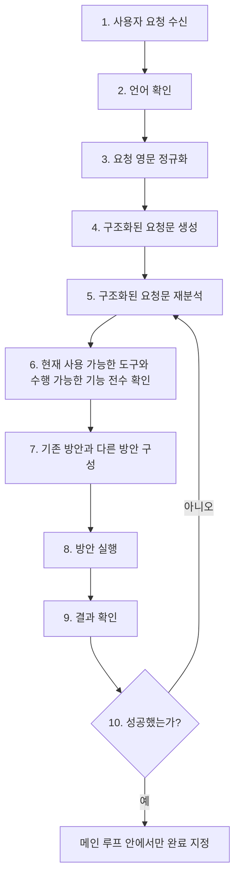
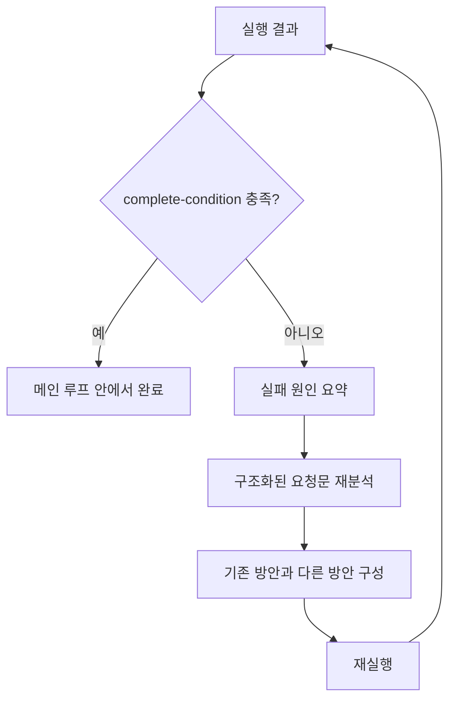
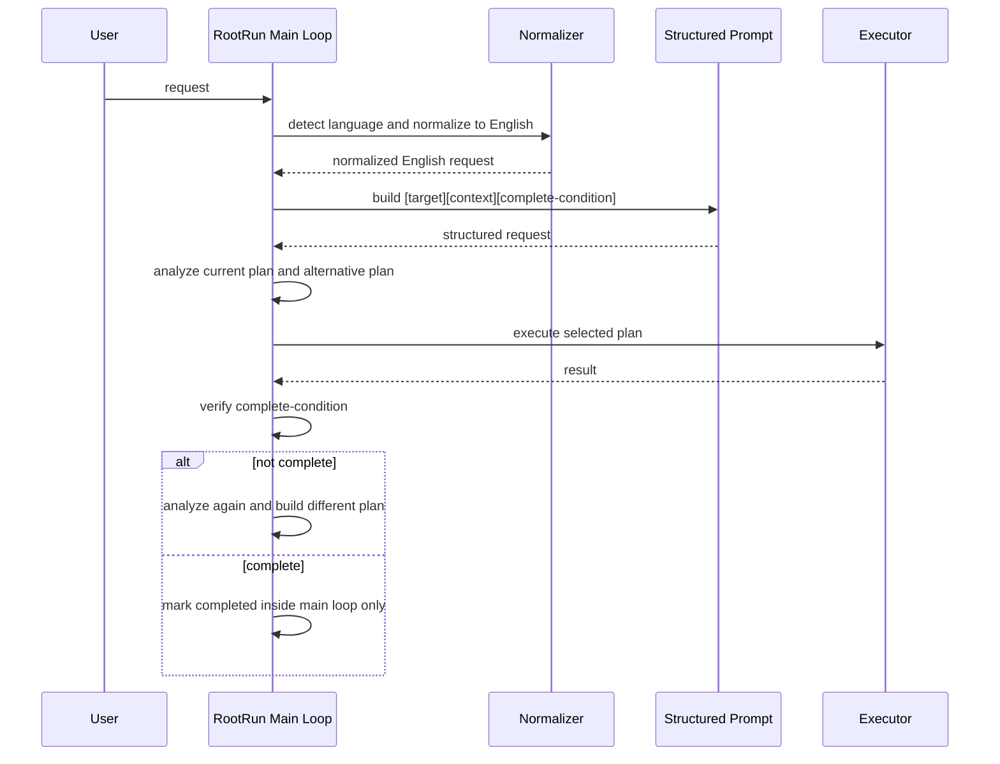

# Nobie 태스크 프로세스

이 문서는 앞으로 Nobie 태스크 프로세스를 어떤 형태로 정리하고 적용할지에 대한 기준 문서다.

핵심 목표는 다음과 같다.

- 메인 루프 밖에서 완료를 선언하지 않는다.
- 모든 케이스 분배는 메인 루프 안에서만 한다.
- 문자열을 여기저기서 직접 비교하는 방식 대신, 먼저 요청을 정규화한 뒤 구조화된 요청문으로 처리한다.
- 한 번 분석하고 끝내지 않고, 성공할 때까지 `재분석 -> 다른 방안 구성 -> 실행 -> 결과 확인`을 반복한다.

여기서 태스크의 실제 실행 단위는 `RootRun`이다.  
하나의 사용자 요청은 세션과 `request_group` 문맥 안에서 처리되며, 최종 완료 여부는 반드시 메인 루프 안에서만 결정된다.

## 1. 최상위 원칙

이 문서는 아래 원칙을 기준으로 이해해야 한다.

1. 사용자 요청은 먼저 언어를 확인한다.
2. 내부 처리 기준 문장은 영문으로 정규화한다.
3. 정규화된 영문 요청은 반드시 구조화된 요청문으로 다시 만든다.
4. 구조화된 요청문을 기준으로 방안을 구성한다.
5. 실행 결과를 확인한 뒤, 성공하지 않았으면 다시 분석한다.
6. 절대 루프 밖에서 최종 완료를 선언하지 않는다.
7. 승인 대기, 추가 입력 대기, LLM 조회, 도구 실행, 오류 복구, 후속 실행 생성도 모두 루프 안에서만 배분한다.

## 2. 기본 프로세스

태스크의 기본 프로세스는 아래 순서를 따른다.

1. 사용자 요청 수신
2. 언어 확인
3. 요청 영문 정규화
4. 구조화된 요청문 생성
5. 구조화된 요청문 재분석
6. 현재 사용 가능한 도구와 수행 가능한 기능 전수 확인
7. 기존 방안과 다른 방안 구성
8. 방안 실행
9. 결과 확인
10. 성공 여부 판단
11. 성공할 때까지 다시 5번으로 회귀

즉, Nobie는 단순히 `요청 -> 실행 -> 끝` 구조가 아니라 아래 루프를 기본으로 해야 한다.



## 3. 구조화된 요청문

사용자 요청을 영문으로 정규화한 뒤에는, 반드시 아래 형태의 요청문으로 다시 만든다.

```text
[target]
...

[to]
...

[context]
...

[complete-condition]
...
```

각 필드의 의미는 다음과 같다.

### 3.1 [target]

실제로 수행해야 하는 직접 목표를 적는다.

예시:

- capture the full main display
- send the screenshot to the same Telegram conversation
- cancel every active recurring reminder in this conversation

### 3.2 [to]

결과가 어디에, 누구에게, 어떤 대상으로 전달되거나 적용되어야 하는지를 적는다. 가능하면 `current channel` 같은 모호한 표현 대신 실제 채널명, 세션, 확장 ID, 위치를 적는다.

예시:

- the current Telegram conversation
- the current channel
- the connected Yeonjang extension on the current machine

### 3.3 [context]

현재 세션, 채널, 연결된 연장, 이전 메시지, 대상 제약 등 실행에 필요한 문맥을 적는다.

예시:

- source channel is telegram
- there is exactly one connected Yeonjang extension
- the user asked for the result to be shown in messenger, not just saved locally

### 3.4 [complete-condition]

무엇을 만족해야 이 태스크를 성공으로 볼지 적는다.

예시:

- the screenshot file is captured
- the binary is delivered back to Nobie
- the image is sent to the same Telegram conversation
- do not stop at local file creation only

## 4. 메인 루프가 해야 하는 일

메인 루프는 단순 실행기가 아니라, 아래 역할을 모두 가진 오케스트레이션 루프다.

### 4.1 요청 정규화

- 사용자 원문 언어 확인
- 내부 기준 영문 변환
- 구조화된 요청문 생성

### 4.2 분석

- 목표가 무엇인지 분석
- 현재 방안이 무엇인지 분석
- 기존 방안의 한계를 분석
- 다른 방안이 있는지 분석

### 4.3 도구와 기능 확인

구조화된 요청문을 다시 분석한 뒤에는, 바로 방안을 고르지 말고 현재 사용할 수 있는 도구와 실제 수행 가능한 기능을 먼저 전수 확인해야 한다.

확인 대상:

- 현재 세션에서 사용 가능한 본체 도구
- 현재 연결된 Yeonjang 도구
- 각 도구가 실제로 지원하는 기능 범위
- 현재 채널에서 결과 전달이 가능한지
- 승인 없이 가능한지, 승인 필요한지
- 현재 실행 환경에서 막혀 있거나 불가능한 기능이 있는지

즉 이 단계에서는 아래 순서를 먼저 거친다.

1. 구조화된 요청문 재분석
2. 현재 사용 가능한 도구 목록 확인
3. 각 도구의 실제 기능 확인
4. 가능한 방안과 불가능한 방안 분리
5. 그 뒤에 기존 방안과 다른 방안 구성

### 4.4 분배

모든 분기는 메인 루프 안에서만 처리한다.

분배 대상:

- 즉시 응답
- 도구 실행
- 연장 실행
- 승인 요청
- 사용자 추가 입력 요청
- LLM 조회
- 오류 복구
- 일정 생성
- 일정 취소
- 후속 실행 생성

### 4.5 실행

방안을 하나 고른 뒤 실행한다.

우선순위 예시:

1. 적절한 Yeonjang 도구
2. 적절한 본체 도구
3. worker/runtime 경로
4. 다른 대안 경로

### 4.6 결과 확인

실행 후에는 반드시 결과를 확인한다.

확인 대상:

- 실제 결과물이 생성되었는가
- 사용자 요구한 채널로 결과가 전달되었는가
- complete-condition을 만족했는가
- 실패 원인이 무엇인가
- 다른 방안이 남아 있는가

## 5. 성공할 때까지 회귀

실패나 미완료가 나오면, 메인 루프는 종료하지 않고 다시 아래 절차로 돌아간다.

1. 실패 원인 요약
2. 구조화된 요청문 재분석
3. 기존 방안과 다른 방안 구성
4. 새 방안 실행
5. 결과 확인

즉 회귀 기준은 `단순 오류 발생`이 아니라, `complete-condition 미충족`이다.



## 6. 완료 규칙

완료 규칙은 매우 엄격해야 한다.

1. 메인 루프 밖에서 완료하지 않는다.
2. 하위 보조 run은 분석만 하고 완료를 확정하지 않는다.
3. 전달이 필요한 요청은 전달이 끝나기 전까지 완료가 아니다.
4. 파일 생성만으로는 충분하지 않다. 사용자가 파일 자체를 원했으면 실제 전달까지 가야 한다.
5. 승인 필요 상태, 추가 입력 필요 상태, 검증 미완료 상태를 완료로 보지 않는다.

즉 `실행했다`와 `완료했다`는 다르다.  
완료는 오직 메인 루프가 `complete-condition 충족`을 확인했을 때만 선언할 수 있다.

## 7. 이 구조를 쓰는 이유

이 구조를 쓰는 목적은 다음과 같다.

- 메인 루프에서 문자열 비교를 최대한 줄이기 위해
- 사용자 원문 언어와 내부 실행 기준 문장을 분리하기 위해
- `target / context / complete-condition`을 명시적으로 만들기 위해
- 기존 방안이 실패했을 때 다른 방안으로 자연스럽게 회귀하기 위해
- 완료 조건을 명확히 해서 너무 이른 완료를 막기 위해

## 8. 현재 코드 적용 방향

이 문서는 앞으로의 메인 루프 정리 기준이다.  
코드는 이 문서 기준으로 다음 방향으로 정리되어야 한다.

### 8.1 Ingress 경계

1. 채널/API/CLI 진입점은 먼저 `Ingress`를 지난다.
2. `Ingress`는 `sessionId`, `runId(requestId)`, `source`를 먼저 고정한다.
3. `Ingress`는 즉시 접수 응답만 반환한다.
4. 무거운 intake 분석과 실제 실행은 `Ingress` 밖에서 계속 진행한다.
5. `request_group` 재사용 여부와 활성 실행 취소 같은 진입 해석은 intake가 아니라 별도 entry-semantics 계층에서 결정한다.

### 8.2 Intake 산출물

1. intake 또는 메인 루프 초입에서 사용자 요청 언어를 식별한다.
2. 내부 처리용 영문 정규화 요청문을 만든다.
3. `target / context / complete-condition` 구조를 명시적으로 생성한다.
4. intake 결과는 `intent envelope`로 고정한다.
5. 이후의 판단은 가능하면 이 envelope 기준으로 처리한다.
6. 완료 여부는 메인 루프의 `complete-condition 충족 여부`로만 결정한다.


